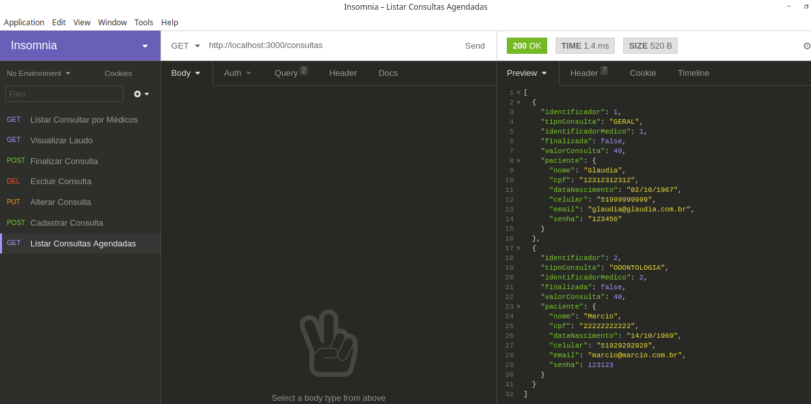
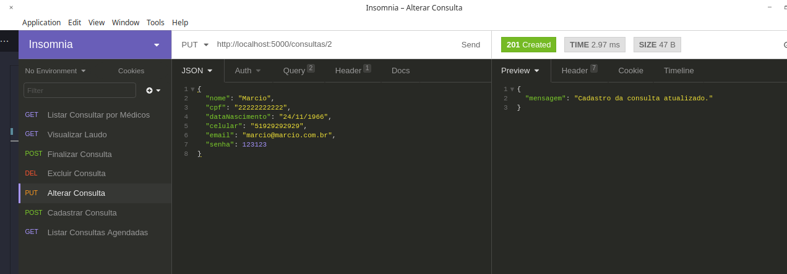

# Desafio Alternativo - Módulo 2 - Curso Backend - JavaScript
# Cubos Academy - Ifood 1000

Este é meu projeto de um Sistema de Controle de Consultas para uma Clinica Médica

## CLINICA MÉDICA - GASPARZINHO CAMARADA

Desafio iniciado em 30/08/2023 - ás 18:17 hrs.

Criar as seguintes RESTFull API:

[ ] Criar consulta médica;
[ ] Listar consultas médicas;
[ ] Atualizar os dados de uma consulta;
[ ] Excluir uma consulta médica;
[ ] Finalizar uma consulta médica;
[ ] Listar o laudo de uma consulta;
[ ] Listar as consultas que um médico atendeu.

### Desenvolvido por: Gláudia Almeida

;

;

;

